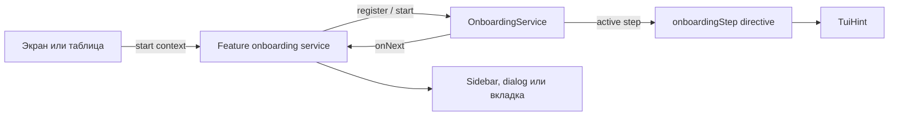
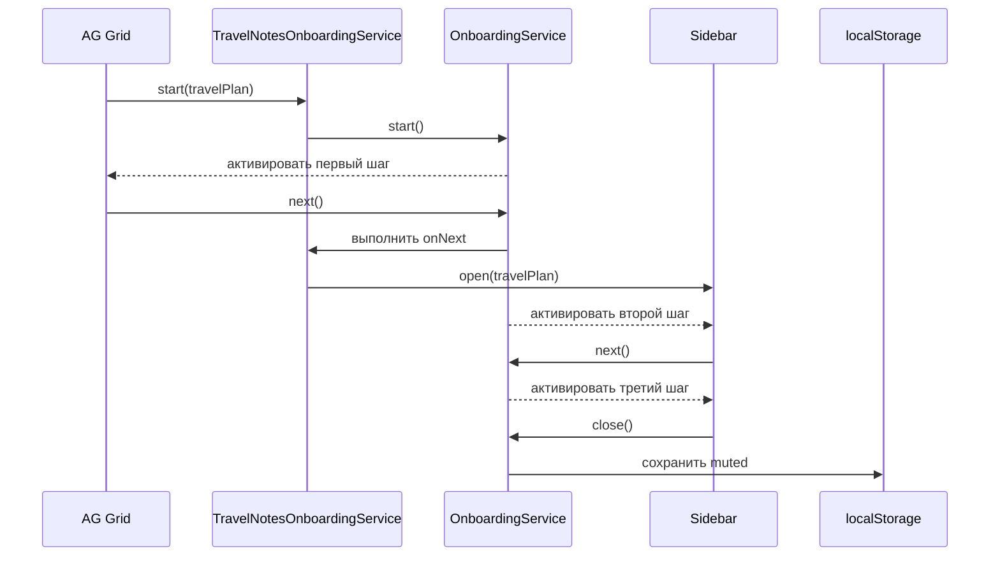

# AG Grid + Taiga UI onboarding prototype

Учебный прототип трехшагового онбординга для AG Grid и правого сайдбара заметок. Демонстрационный сценарий построен вокруг планирования путешествий и не привязан к реальному корпоративному продукту.

Репозиторий показывает, как собрать переиспользуемый онбординг на Angular и Taiga UI без отдельной tour-библиотеки.

## Стек

- Angular 19.2.6;
- Taiga UI 4.69.0;
- AG Grid 34.2.0;
- без `ngx-ui-tour-tui-hint`.

## Как устроено решение

Главная идея: общая инфраструктура управляет шагами, а feature-сервис описывает конкретный пользовательский сценарий.

```text
ГДЕ показать    -> [onboardingStep]
ЧТО показать    -> Angular-компонент шага
В КАКОМ порядке -> OnboardingService
ЧТО сделать     -> feature-сервис и onNext
```



### Общая инфраструктура

Общий слой находится в `src/app/onboarding` и ничего не знает о маршрутах, таблицах или sidebar.

- `OnboardingService` хранит зарегистрированную последовательность и активный шаг;
- `OnboardingStepDirective` связывает шаг с DOM-элементом и скрывает интеграцию с `TuiHint`;
- `OnboardingStepComponent` задает общий layout карточки: крестик, контент, счетчик и кнопку;
- `onboarding.types.ts` содержит типы definition- и runtime-шагов.

### Feature-слой

`TravelNotesOnboardingService` отвечает только за сценарий заметок о путешествии:

- регистрирует три шага;
- хранит выбранный `TravelPlanDto`;
- определяет, какая строка AG Grid является target первого шага;
- открывает sidebar в `onNext` первого шага;
- снимает регистрацию при уничтожении feature-сервиса.



## API `OnboardingService`

### `register()`

Регистрирует последовательность и возвращает типизированный tuple runtime-шагов с индексами.

```ts
public readonly steps = this.onboarding.register({
    id: 'travel-notes',
    version: 1,
    steps: [
        {
            content: FIRST_STEP,
            onNext: () => this.openSidebar(),
        },
        {content: SECOND_STEP},
        {content: THIRD_STEP},
    ] as const,
});
```

`id` используется для ключа `localStorage`:

```text
@onboarding.{id}.v{version}
```

Для примера выше:

```text
@onboarding.travel-notes.v1
```

Если онбординг значительно изменился и его нужно показать повторно, увеличьте `version`.

### `start()`

Активирует первый шаг и возвращает `true`, если запуск состоялся.

```ts
const started = this.onboarding.start();
```

Метод вернет `false`, когда последовательность не зарегистрирована или пользователь уже завершил эту версию онбординга.

В демо есть `ignoreMuted`, чтобы кнопка ручного запуска могла повторно показать сценарий. Для обычной продуктовой интеграции достаточно вызывать `start()` без аргументов.

### `next()`

Сначала выполняет `onNext` текущего шага, затем активирует следующий шаг.

Это позволяет открыть sidebar или dialog до показа следующей подсказки.

```text
onNext текущего шага
-> подготовка нового DOM
-> активация следующего шага
```

### `close()`

Завершает онбординг, записывает `muted` в `localStorage` и скрывает активный шаг.

Используется для крестика, кнопки `Понятно` и завершения последнего шага.

### `unregister()`

Технически удаляет текущую регистрацию и не записывает прохождение в `localStorage`.

Feature-сервис должен вызвать его при уничтожении:

```ts
inject(DestroyRef).onDestroy(() => this.onboarding.unregister());
```

## Как добавить свой онбординг

### 1. Создайте компоненты шагов

Каждый шаг является обычным Angular-компонентом и экспортируется через `PolymorpheusComponent`.

```ts
@Component({
    imports: [OnboardingStepComponent, TuiButton, TuiTitle],
    template: `
        <onboarding-step>
            <h3 tuiTitle>
                Новая возможность
                <span tuiSubtitle>Короткое объяснение для пользователя</span>
            </h3>

            <div class="preview">Пример интерфейса</div>

            <button
                appearance="flat"
                size="s"
                tuiButton
                type="button"
                (click)="onboarding.next()"
            >
                Далее
            </button>
        </onboarding-step>
    `,
})
export class FirstStepComponent {
    protected readonly onboarding = inject(OnboardingService);
}

export const FIRST_STEP = new PolymorpheusComponent(FirstStepComponent);
```

Последний шаг обычно вызывает `onboarding.close()` и показывает кнопку `Понятно`.

### 2. Создайте feature-сервис

Feature-сервис хранит бизнес-контекст и регистрирует шаги.

```ts
@Injectable()
export class FeatureOnboardingService {
    private readonly onboarding = inject(OnboardingService);
    private readonly target = signal<Entity | null>(null);

    public readonly steps = this.onboarding.register({
        id: 'feature-name',
        version: 1,
        steps: [
            {
                content: FIRST_STEP,
                onNext: () => {
                    const entity = this.target();

                    if (entity) {
                        this.openSidebar(entity);
                    }
                },
            },
            {content: SECOND_STEP},
        ] as const,
    });

    public constructor() {
        inject(DestroyRef).onDestroy(() => this.onboarding.unregister());
    }

    public start(entity: Entity): boolean {
        this.target.set(entity);

        const started = this.onboarding.start();

        if (!started) {
            this.target.set(null);
        }

        return started;
    }

    public isFirstStepTarget(entity: Entity): boolean {
        return (
            this.onboarding.isActive(this.steps[0]) &&
            this.target()?.id === entity.id
        );
    }

    private openSidebar(entity: Entity): void {
        // Бизнес-действие feature-слоя
    }
}
```

### 3. Привяжите шаги к DOM

Для единственного элемента достаточно передать шаг:

```html
<div [onboardingStep]="featureOnboarding?.steps[1] ?? null">
    Target второго шага
</div>
```

Для повторяющихся элементов, например строк таблицы, только один renderer должен получить первый шаг:

```html
<div
    [onboardingStep]="
        featureOnboarding?.isFirstStepTarget(entity)
            ? featureOnboarding.steps[0]
            : null
    "
    onboardingStepDirection="right"
>
    <button>Открыть</button>
</div>
```

### 4. Подключите provider и feature flag

В демо `provideTravelNotesOnboarding()` возвращает feature-сервис при включенном `enableOnboarding` и `null` при выключенном флаге.

```json
{
  "features": {
    "enableOnboarding": true
  }
}
```

При выключенном флаге feature-сервис не создается и последовательность не регистрируется.

### 5. Запускайте только после появления первого anchor

`OnboardingService` не ищет элементы в DOM. Перед `start()` экран должен быть готов.

Для обычного компонента это означает, что target уже создан. Для виртуализированной таблицы порядок может выглядеть так:

```text
данные загружены
-> сохраненные sort/filter/grouping применены
-> нужная колонка показана
-> строка приведена в viewport
-> featureOnboarding.start(entity)
```

Не используйте случайный `setTimeout` для ожидания DOM. Лучше подписаться на явное событие готовности компонента или таблицы.

## Важные ограничения

### Одна последовательность на экземпляр сервиса

Один `OnboardingService` поддерживает одну регистрацию. Повторный `register()` без `unregister()` завершится ошибкой `Another onboarding is already registered`.

### Anchor должен иметь реальный размер

Не используйте `display: contents` на wrapper с `[onboardingStep]`: `TuiHint` нужен реальный DOM-элемент с размером.

### Не размещайте два `tuiHint` на одном элементе

`OnboardingStepDirective` уже подключает `TuiHintDirective`.

Неправильно:

```html
<button
    tuiHint="Обычная подсказка"
    [onboardingStep]="step"
></button>
```

Правильно:

```html
<span class="onboarding-anchor" [onboardingStep]="step">
    <button tuiHint="Обычная подсказка"></button>
</span>
```

### Виртуализация

В AG Grid первая строка модели не обязательно существует в DOM. Перед запуском приведите выбранный row node и колонку в viewport.

## Частые проблемы

### Hint не появился

Проверьте:

- `start()` вернул `true`;
- `[onboardingStep]` получил шаг, а не `null`;
- первый anchor существует в DOM;
- target не скрыт и не уничтожен виртуализацией;
- эта версия онбординга не была завершена раньше.

### Второй шаг не появился

Убедитесь, что `onNext` первого шага создает DOM второго anchor до активации следующего шага.

### Нужно повторно проверить первый запуск

```js
localStorage.removeItem('@onboarding.travel-notes.v1');
location.reload();
```

## Локальный запуск

```bash
npm ci
npm start
```

Откройте `http://localhost:4200`.

Чтобы отключить онбординг, установите `enableOnboarding: false` в `src/config.json` и перезапустите приложение.

## Демонстрационный сценарий

1. Таблица содержит вымышленные маршруты, страны, сезоны, длительность и статус планирования.
2. Первый шаг привязан к иконке заметок выбранного маршрута в AG Grid.
3. Кнопка `Далее` выполняет `onNext` первого шага и открывает sidebar с выбранным `TravelPlanDto`.
4. Второй шаг объясняет категории заметок: `Все`, `Подготовка` и `Впечатления`.
5. Третий шаг показывает, как добавить важную заметку в чек-лист подготовки.
6. Крестик или `Понятно` сохраняют `muted` в `localStorage`.
7. `Escape` не закрывает онбординг.
8. Прозрачный backdrop блокирует интерфейс под текущим шагом.

## Production build

```bash
npm run build
```

Для GitHub Pages:

```bash
npm run build:pages
```

Результат находится в `dist/agrid-taiga-onboarding/browser`.

Workflow `.github/workflows/pages.yml` устанавливает зависимости через `npm ci`, собирает каждый Pull Request и публикует GitHub Pages после push в `main`.
